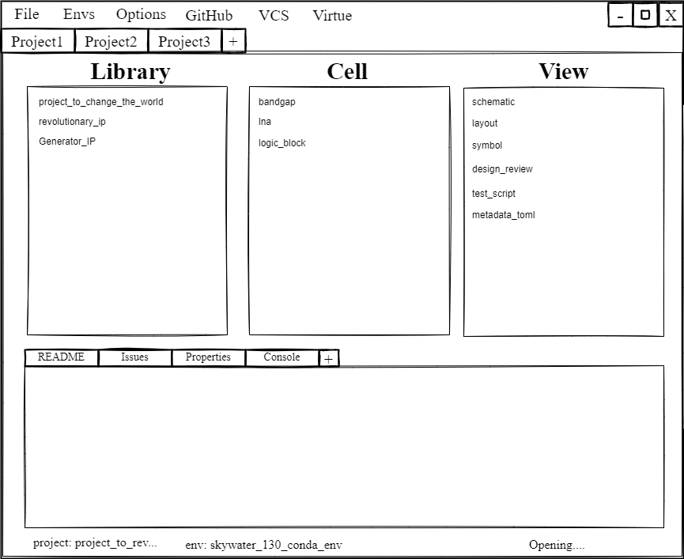

# Overview

Viper is a **hybrid integrated circuit design environment**.
It supports design workflows with both open-source and proprietary software
tools.  It also natively supports software and generator based circuit design
flows in addition to traditional flows.

It supports both open source tools and Cadence Virtuoso with the
[Virtue](https://www.cascode-labs.org/virtue/)
package.  It also supports extensions to easily extend its functionality.

## Commands

* `viper open <project_name>` - Open a project in the project manager gui
* `viper config` - Read the viper environment configuration
* `viper project create <project_name>` - Create a new Viper project
* `viper welcome` - Display a welcome message with the version and
  documentation URL
* `viper --help` - Print a help message
* `viper --docs` - Print the URL to the documentation

## Project Manager

**Still under development**

## Viper Design Environment
EDA environments can be difficult and messy to setup. Viper simplifies
this process with declaritive toml configuration files.  It also makes tool
selection and initialization pythonic by turning them into Python Conda
packages and installing them into virtual design environments.

## Viper-forge
[Viper-forge](https://www.cascode-labs.org/viper-forge/)
is an initiative to develop conda recipes to package EDA tools
into conda packages hosted on [conda-forge](https://conda-forge.org/).

## Contributing

All development planning happens in
[GitHub issues](https://github.com/cascode-labs/viper/issues) and
[GitHub discussions](https://github.com/cascode-labs/viper/discussions).

If you see an issue of interest, first check to see if there is an existing
branch named after its issue number.  Then feel free to comment on the issue
and hopefully submit a pull request with your update.

For more general questions or if you're looking for guidance on getting
started, post in
[GitHub discussions](https://github.com/cascode-labs/viper/discussions).
